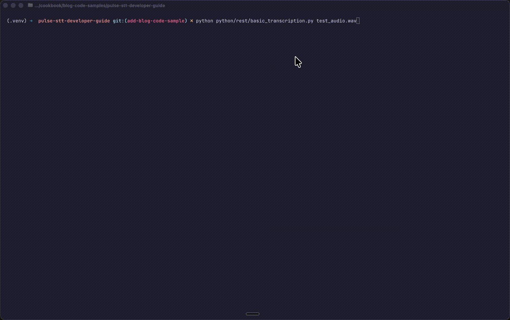
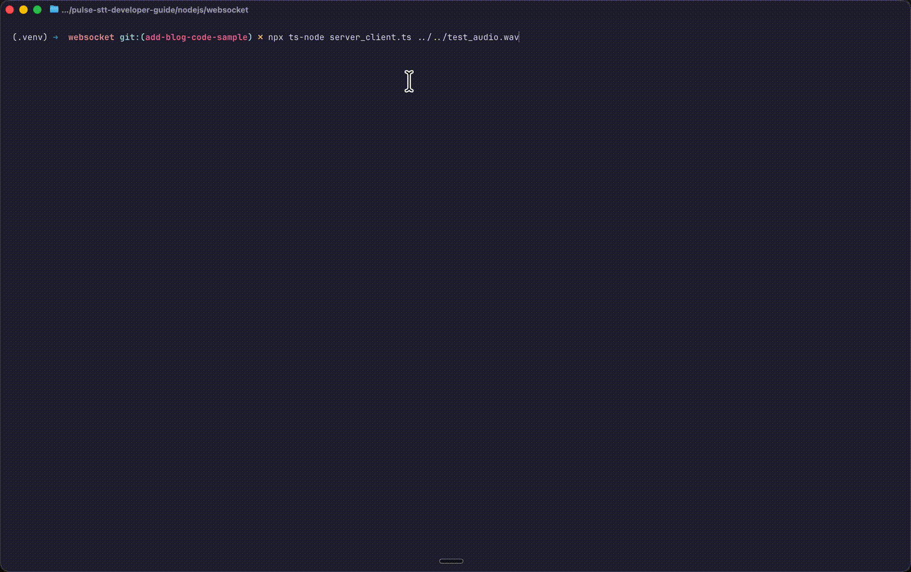

# Pulse STT Developer Guide - Code Samples

Code samples from the blog post: **"Developer Guide: Integrating AI Voice & Speech APIs with Smallest AI Pulse"**

## 🎬 Demos

### Python Transcription 


### Node.js WebSocket Streaming


---

## 📁 Structure

```
pulse-stt-developer-guide/
├── python/
│   ├── rest/
│   │   ├── basic_transcription.py      # Basic file transcription
│   │   ├── url_transcription.py        # Transcribe from URL
│   │   └── async_batch.py              # Async batch processing
│   └── websocket/
│       └── streaming_client.py         # Real-time streaming (file or mic)
├── nodejs/
│   ├── rest/
│   │   └── transcription.ts            # File transcription
│   └── websocket/
│       ├── browser_client.js           # Browser-based ASR
│       └── server_client.ts            # Node.js streaming client
├── demo-app/                           # Next.js demo application
├── utils/
│   ├── audio_preprocessing.py          # Audio format conversion
│   └── ffmpeg_commands.sh              # FFmpeg one-liners
├── requirements.txt                    # Python dependencies
├── package.json                        # Node.js dependencies
└── env.example                         # Environment variables template
```

## 🚀 Quick Start

### Prerequisites

1. Get your API key from [console.smallest.ai](https://console.smallest.ai/apikeys)
2. Set environment variable:
   ```bash
   export SMALLEST_API_KEY="your_api_key_here"
   ```

### Get a Test Audio File

```bash
# Download a sample WAV file
curl -L "https://www.voiptroubleshooter.com/open_speech/american/OSR_us_000_0010_8k.wav" -o test_audio.wav
```

---

## 🐍 Python Examples

### Setup with uv (Recommended)

```bash
# Create virtual environment
uv venv python/.venv

# Activate it
source python/.venv/bin/activate

# Install dependencies
uv pip install -r requirements.txt
```

### Test REST API (Pre-Recorded)

```bash
cd python/rest

# Basic transcription
python basic_transcription.py ../../test_audio.wav

# Transcribe from URL
python url_transcription.py "https://www.voiptroubleshooter.com/open_speech/american/OSR_us_000_0010_8k.wav"
```

### Test WebSocket API (Streaming)

```bash
cd python/websocket

# Stream a file (recommended for testing)
python streaming_client.py --file ../../test_audio.wav

# With different language
python streaming_client.py --file ../../test_audio.wav --language multi
```

### Optional: Microphone Support

To use real-time microphone input, install `portaudio` first:

```bash
# macOS
brew install portaudio

# Ubuntu/Debian
sudo apt-get install portaudio19-dev

# Then install pyaudio
uv pip install pyaudio

# Run with microphone
python websocket/streaming_client.py --language en
```

---

## 📦 Node.js Examples

### Setup

```bash
# Install dependencies
npm install
```

### Test REST API

```bash
cd nodejs/rest

# Transcribe a file
npx ts-node transcription.ts ../../test_audio.wav
```

### Test WebSocket API

```bash
cd nodejs/websocket

# Stream a file
npx ts-node server_client.ts ../../test_audio.wav

# With different language
npx ts-node server_client.ts ../../test_audio.wav --language hi
```

---

## 🎨 Demo App (Next.js)

Interactive web app with file upload and real-time microphone transcription.

```bash
cd demo-app

# Install dependencies
npm install

# Set API key
echo 'SMALLEST_API_KEY=your_api_key_here' > .env.local

# Run both Next.js app and WebSocket proxy
npm run dev:all

# Open http://localhost:3000
```

See [demo-app/README.md](./demo-app/README.md) for detailed instructions.

---

## 📋 API Reference

### REST API (Pre-Recorded)

**Endpoint:** `POST https://waves-api.smallest.ai/api/v1/pulse/get_text`

| Parameter | Type | Description |
|-----------|------|-------------|
| `model` | string | `pulse` |
| `language` | string | `en`, `hi`, `multi` (auto-detect) |
| `word_timestamps` | boolean | Include word-level timing |
| `diarize` | boolean | Speaker diarization |
| `emotion_detection` | boolean | Detect emotions |

### WebSocket API (Real-Time)

**Endpoint:** `wss://waves-api.smallest.ai/api/v1/pulse/get_text`

| Parameter | Type | Default | Description |
|-----------|------|---------|-------------|
| `language` | string | `en` | Language code or `multi` |
| `encoding` | string | `linear16` | Audio encoding format |
| `sample_rate` | string | `16000` | Sample rate in Hz |
| `word_timestamps` | string | `true` | Word-level timestamps |
| `full_transcript` | string | `false` | Cumulative transcript |
| `diarize` | string | `false` | Speaker diarization |
| `redact_pii` | string | `false` | Redact personal info |
| `redact_pci` | string | `false` | Redact payment info |

---

## ✅ Test Checklist

| Test | Command | Expected |
|------|---------|----------|
| Python REST | `python python/rest/basic_transcription.py test_audio.wav` | Transcription text |
| Python WS | `python python/websocket/streaming_client.py -f test_audio.wav` | Streaming transcripts |
| Node REST | `npx ts-node nodejs/rest/transcription.ts test_audio.wav` | Transcription text |
| Node WS | `npx ts-node nodejs/websocket/server_client.ts test_audio.wav` | Streaming transcripts |
| Demo App | `cd demo-app && npm run dev:all` | Web UI at localhost:3000 |

---

## 🔗 Resources

- [Waves Documentation](https://waves-docs.smallest.ai)
- [Smallest AI Console](https://console.smallest.ai)
- [Python SDK](https://github.com/smallest-inc/smallest-python-sdk)
- [Discord Community](https://discord.gg/5evETqguJs)

## 📝 License

MIT License - See [LICENSE](../../LICENSE) for details.
