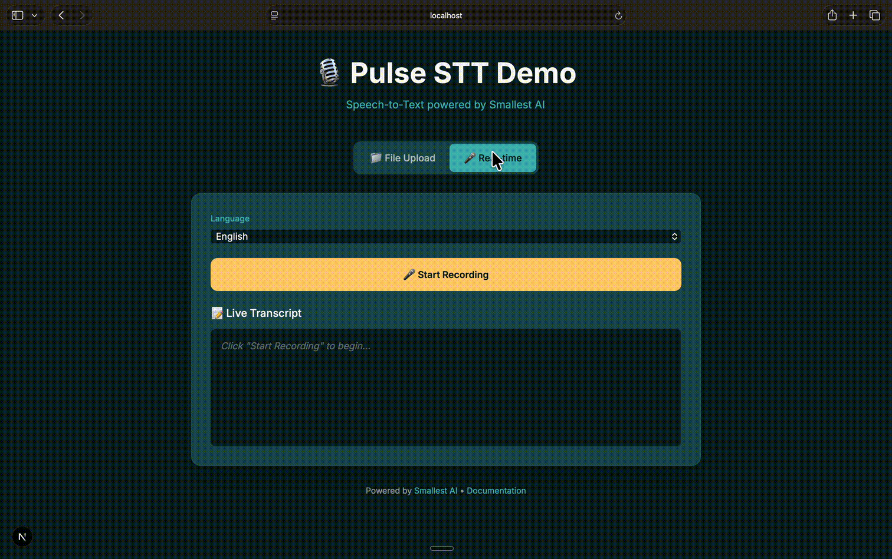

# Pulse STT Demo App

A Next.js demo application showcasing Smallest AI's Pulse Speech-to-Text API with both file upload and real-time microphone transcription.

## Demo



## Features

- 📁 **File Upload Transcription** - Upload audio files and get transcription with:
  - Word-level timestamps
  - Speaker diarization
  - Emotion detection
  - Age/gender estimation

- 🎤 **Real-time Microphone Transcription** - Live streaming with:
  - Instant transcription as you speak
  - Interim (partial) and final results
  - Secure WebSocket proxy (API key stays server-side)

## Quick Start

### 1. Install Dependencies

```bash
npm install
```

### 2. Set Environment Variable

Create a `.env.local` file:

```bash
echo 'SMALLEST_API_KEY=your_api_key_here' > .env.local
```

### 3. Run Both Servers

```bash
npm run dev:all
```

This starts:
- **Next.js** on `http://localhost:3000` (UI)
- **WebSocket Proxy** on `ws://localhost:3001` (real-time STT)

### 4. Open in Browser

Go to **http://localhost:3000** in Chrome or Safari (for microphone access).

## Running Servers Separately

If you prefer to run them in separate terminals:

```bash
# Terminal 1: Next.js
npm run dev

# Terminal 2: WebSocket Proxy
npm run dev:ws
```

## Architecture

```
┌─────────────────┐     ┌─────────────────┐     ┌─────────────────┐
│     Browser     │────▶│   Next.js API   │────▶│    Pulse STT    │
│   (localhost)   │     │  (File Upload)  │     │   (REST API)    │
└─────────────────┘     └─────────────────┘     └─────────────────┘
         │
         │ WebSocket
         ▼
┌─────────────────┐     ┌─────────────────┐
│  WS Proxy :3001 │────▶│    Pulse STT    │
│   (Audio Stream)│     │  (WebSocket)    │
└─────────────────┘     └─────────────────┘
```

## API Routes

| Route | Method | Description |
|-------|--------|-------------|
| `/api/transcribe` | POST | Upload audio file for transcription |
| `ws://localhost:3001` | WebSocket | Real-time audio streaming proxy |

## Project Structure

```
demo-app/
├── src/
│   └── app/
│       ├── api/
│       │   └── transcribe/
│       │       └── route.ts     # REST API for file upload
│       ├── page.tsx             # Main UI component
│       ├── layout.tsx
│       └── globals.css
├── ws-server.js                 # WebSocket proxy server
├── .env.local                   # Your API key
└── package.json
```

## Scripts

| Script | Description |
|--------|-------------|
| `npm run dev` | Start Next.js only |
| `npm run dev:ws` | Start WebSocket proxy only |
| `npm run dev:all` | Start both (recommended) |
| `npm run build` | Build for production |

## Tech Stack

- **Next.js 16** - React framework with App Router
- **Tailwind CSS** - Styling
- **TypeScript** - Type safety
- **ws** - WebSocket client/server for Node.js
- **concurrently** - Run multiple commands

## Troubleshooting

### Microphone not working?
- Open in **Chrome** or **Safari** (not embedded browsers)
- Allow microphone permission when prompted
- Check that WebSocket proxy is running (`npm run dev:ws`)

### WebSocket connection failed?
- Ensure both servers are running: `npm run dev:all`
- Check port 3001 is not blocked

### API errors?
- Verify your API key in `.env.local`
- Check console for detailed error messages

## Resources

- [Smallest AI Console](https://console.smallest.ai) - Get API key
- [Waves Documentation](https://waves-docs.smallest.ai) - Full API reference
- [GitHub](https://github.com/smallest-inc) - Official repositories
