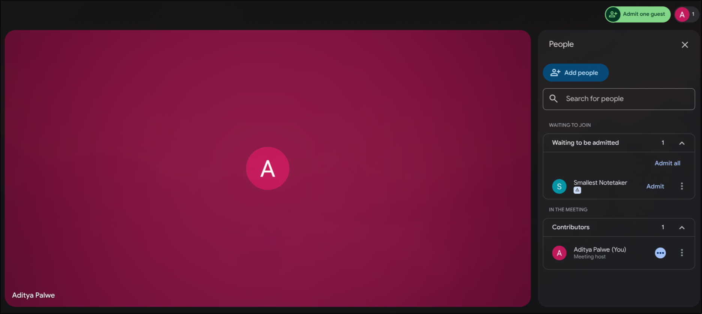

# Meeting Notes Generator

Automatically join **Google Meet, Zoom, or Microsoft Teams**, transcribe with Pulse STT, and generate structured meeting notes with intelligent speaker identification.

---

## How It Works

```
┌────────────┐    ┌────────────┐    ┌────────────┐    ┌────────────┐
│ Recall.ai  │ →  │  Download  │ →  │ Pulse STT  │ →  │   GPT-4o   │
│ Join Meet  │    │   Audio    │    │ Transcribe │    │ Summarize  │
└────────────┘    └────────────┘    └────────────┘    └────────────┘
```

1. **Recall.ai** creates a bot that joins your meeting (Google Meet, Zoom, or Teams)
2. **Admit the bot** when prompted in the meeting
3. **Bot records** the entire meeting audio
4. **Meeting ends** → Audio is downloaded
5. **Pulse STT** transcribes with speaker diarization
6. **GPT-4o** generates structured meeting notes with name mapping

### Admitting the Bot

When the bot joins, you'll see it in the "Waiting to be admitted" section. Click **Admit** to let it in:



---

## Intelligent Name Mapping

The bot automatically identifies speaker names from the conversation using GPT-4o:

| Transcript | Notes Output |
|------------|--------------|
| `Speaker 1: Hey everyone, this is Alex from engineering` | Uses **"Alex"** throughout the notes |
| `Speaker 2: Thanks Sarah, I'll handle that` | Maps Speaker 2 → **"Sarah"** |
| `Speaker 3: [name never mentioned]` | Falls back to **"speaker_3"** |

This means your action items, quotes, and summaries use **real names** instead of generic "Speaker 1" labels.

---

## Requirements

```bash
pip install requests openai
```

## Environment Variables

```bash
export RECALL_API_KEY="your-recall-api-key"      # From https://recall.ai
export SMALLEST_API_KEY="your-smallest-api-key"  # From https://smallest.ai/console
export OPENAI_API_KEY="your-openai-api-key"      # From https://platform.openai.com
```

## Usage

```bash
# Google Meet
python python/bot.py "https://meet.google.com/abc-defg-hij" "Notes Bot"

# Zoom
python python/bot.py "https://zoom.us/j/1234567890" "Notes Bot"

# Microsoft Teams
python python/bot.py "https://teams.microsoft.com/l/meetup-join/..." "Notes Bot"
```

**Arguments:**
- `<meet_url>` — Meeting URL (Google Meet, Zoom, or Microsoft Teams)
- `[bot_name]` — Name the bot appears as (default: "Notes Bot")

<details>
<summary><strong>📋 Sample Run</strong> (click to expand)</summary>

```
$ python python/bot.py "https://meet.google.com/ivm-ojjk-htz" "Smallest Notetaker"

Creating bot to join: https://meet.google.com/ivm-ojjk-htz
Bot created: 4cf29b90-ddc8-4a29-957a-50f6e62ad7d3
Bot will appear as: Smallest Notetaker
--------------------------------------------------
Waiting for meeting to end...
Status: pending
Bot is in waiting room. Please admit the bot.
Bot is in waiting room. Please admit the bot.
Recording...
Recording...
Meeting ended. Processing recordings...

Fetching audio recording...
Waiting for audio to be processed...
Audio ready!
Downloading audio...
Saved: ivmojjkhtz_audio.mp3
Transcribing with Pulse STT...
Transcription complete
Saved: ivmojjkhtz_transcript.txt
Generating meeting notes with GPT-4o...
Saved: ivmojjkhtz_notes.md

==================================================
MEETING NOTES
==================================================
# Meeting Notes

**Date:** January 23, 2026

## Attendees
- Aditya, smallest.ai

## Summary
Aditya from smallest.ai conducted a demonstration of a meeting bot
designed to transcribe and summarize meetings...

## Action Items
| Owner  | Task                           | Deadline |
|--------|--------------------------------|----------|
| Aditya | Finalize the meeting transcription | N/A  |

## Notable Quotes
- "This is a demo of testing the meeting bot..." - Aditya

Done!
```

</details>

---

## Output

| File | Description |
|------|-------------|
| `{id}_audio.mp3` | Meeting audio recording |
| `{id}_transcript.txt` | Full transcript with speaker labels |
| `{id}_notes.md` | Structured meeting notes with real names |

### Example Notes

```markdown
# Meeting Notes

**Date:** January 21, 2026

## Attendees
- Alex (Engineering)
- Sarah (Product)
- speaker_3 (unidentified)

## Summary
Alex presented the Q1 roadmap. Sarah raised concerns about timeline...

## Action Items
| Owner | Task | Deadline |
|-------|------|----------|
| Alex | Finalize API spec | Jan 28 |
| Sarah | Review designs | Jan 25 |
| speaker_3 | Send follow-up email | TBD |

## Notable Quotes
> "We need to ship this by end of month" — Alex
```

---

## Why Pulse STT?

Using Smallest AI's Pulse STT instead of Recall's built-in transcription gives you:

- **Speaker diarization** — Know who said what
- **30+ language support** — Multi-language meetings
- **Higher accuracy** — Industry-leading transcription quality
- **Consistent pipeline** — Same STT across all your apps

---

## API Reference

- [Recall.ai API Docs](https://docs.recall.ai)
- [Pulse STT API](https://waves-docs.smallest.ai/v4.0.0/content/api-references/pulse-asr)
- [OpenAI Chat API](https://platform.openai.com/docs/api-reference/chat)
